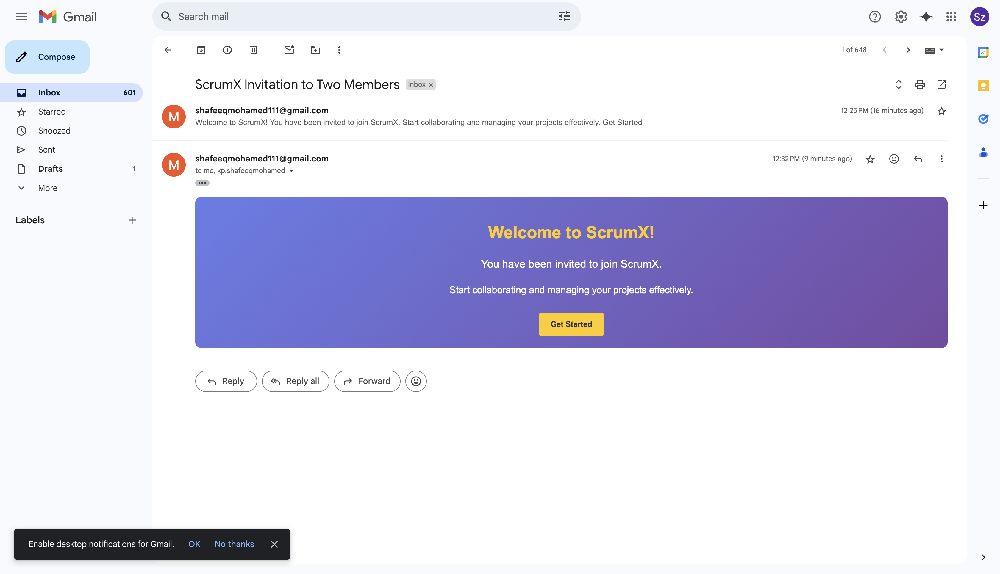

### **README.md**  

sh stands for Shell

# 📧 NodeMailer Email Sender  

A simple Node.js application that sends emails using **Nodemailer** with Gmail authentication.  

## 🚀 Features  
- Send emails using Gmail.  
- Supports **HTML templates** for colorful emails.  
- Uses **dotenv** for secure environment variables.  

## 🛠️ Installation  

1. Clone this repository:  
   ```sh
   git clone https://github.com/your-username/your-repo-name.git
   ```
2. Navigate to the project directory:  
   ```sh
   cd NodeMailer
   ```
3. Install dependencies:  
   ```sh
   npm install
   ```
4. Create a `.env` file in the root directory and add:  
   ```
   EMAIL=your-email@gmail.com
   PASS=your-app-password
   ```

## 📩 Sending an Email  

1. Run the server:  
   ```sh
   node server.js
   ```
2. If successful, you should see:  
   ```
   Email sent: 250 OK
   ```

## 📝 Environment Variables  
Make sure you set up an **App Password** for Gmail (if using Gmail) and store it in the `.env` file.  

- `EMAIL`: Your Gmail address  
- `PASS`: Your Gmail app password  

## 🏗️ Dependencies  
- [Node.js](https://nodejs.org/)  
- [Nodemailer](https://nodemailer.com/)  
- [Dotenv](https://www.npmjs.com/package/dotenv)  

## 👨‍💻 Author  
**Shafeeq Mohamed**  

---

